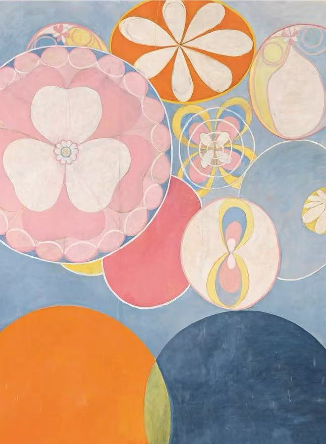

# zzha0182_Final_individual
## The Instruction of Individual Work:
My personal work, the work presented a regular, tension animation. Based on perlin noise and randomness, some elements of the picture are created by changing their size, color and position.
## The Individual Code Chose:
Perlin noise
## The Animation Explanation:
The way I chose to animate was Perlin noise with randomness. Compared with click or time driven, Perlin noise can achieve a more natural, continuous and non-repetitive change effect, so that the image presents a soft sense of fluctuation.

My animation extension didn't change the structure of the team's drawing. Instead, it was a function wrapper that superimposed dynamic effects on top of the original drawing. These animations include:

Outer color block animation: The color block fluctuates continuously, creating a sense of rhythm like the rotation of the color wheel.
1. Dynamic color change of petals: simulate the "breathing" blooming of flowers through color change.
2. Green ring flicker: Saturation and brightness change based on noise, making it appear to glow.
3. Solar and Lunar disk zooming: Slightly zooming animations simulate the sun and moon breathing.
4. Blue circle pulsating: constantly changing color and size, conveying the visual sense of wavy water.
5. Egg ring light rotation and breathing: rotation and scaling to show its softness and instability.
frameCount * 0.01 was used as the driving variable for all animations to form a uniform animation rhythm for the whole figure.

## The Inspiration:

My inspiration comes from the exploration of ritual, circular structure and pattern order. Inspired by Hilma Af Klint, I hope to construct a visual rhythm that is both unified and rich through repetitive graphic language.

Each circle resembles a planet, some symbolising the sun and moon, others a dessert or a plate, embodying a metaphorical link between vision and taste. The background of the work is divided into black and white diagonals, forming a clear visual guidance and enhancing the overall composition tension.

We want these elements to be more than just static decoration, but to express a sense of life and rhythm through subsequent animation, making it a "breathing image".

## The Technical Explanation:
I used the noise() function from p5.js to generate smooth and continuous pseudo-random values that drive the shape in multiple dimensions, such as color, size, rotation, and so on.

Here are the main animation modules and their code descriptions:
This is drawAnimatedSectors
、、、
function drawAnimatedSectors(cx, cy, t) {
  const numBlocks = 36;
  const angleStep = TWO_PI / numBlocks;
  noStroke();
  for (let i = 0; i < numBlocks; i++) {
    const n = noise(t + i * 0.1);         // Perlin 噪声驱动颜色变化
    const r = map(n, 0, 1, 100, 255);
    const g = map(n, 0, 1, 50, 200);
    const b = map(n, 0, 1, 100, 255);
    fill(r, g, b, 180);
    arc(cx, cy, RADIUS * 2, RADIUS * 2, i * angleStep, (i + 1) * angleStep, PIE);
  }
}
、、、